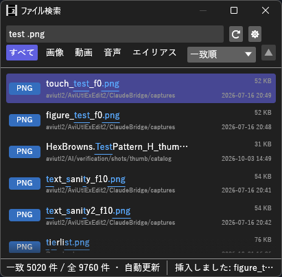

# FileFinder_H マニュアル



**FileFinder_H** は、指定したフォルダ以下のファイルを**あいまい検索**して、クリック 1 回（またはドラッグ）でタイムラインに置くプラグイン（Rust 製 `.aux2`）です。
Rusty Scripts Search（エフェクトの検索）と同じ操作感で素材フォルダを探せ、ファイル検索ソフト **Everything** の使い勝手（種類のフィルタ・並べ替え・`ext:` などの検索構文・変更の自動反映）も取り入れています。

- **バージョン:** 0.3.0（2026-10-10: 検索欄の Esc を「入力する前の文字に戻す → 空にする → 欄から抜ける」の順にした。設定の窓を Esc で閉じられるようにした。0.2.2 でフォルダ選択ダイアログを本体の手前に出す。設定・履歴が読めないときに上書きしない。0.2.1 で終了時に落ちるのを直した）
- **作者:** by HexBrowns
- **必要環境:** AviUtl2 **2.1.10** 以上

---

## 開き方

- **表示** メニュー → **ファイル検索**（ウィンドウ配置パネルからも選択可）

表示リストに出ない場合は AviUtl2 を再起動してください。

## 導入

1. [Releases](https://github.com/HexBrowns/FileFinder_H/releases) から `HexBrowns.FileFinder_H-v0.3.0.au2pkg.zip` をダウンロードし、AviUtl2 のプレビューへドラッグ&ドロップする
   （手で置くなら、中の `Plugin` フォルダを AviUtl2 のデータフォルダ（既定は `C:\ProgramData\aviutl2`）へコピーする）。
   `Plugin\FileFinder_H\FileFinder_H.aux2` が置かれます
2. AviUtl2 を再起動する
3. **表示** メニュー → **ファイル検索** でウィンドウを開く

v0.2.1 までは zip を展開して置く形でした。上書きで入れ替えて構いません（設定と履歴はそのまま使えます）。

### ビルド（開発者向け）

リポジトリのルートで [aviutl2-cli](https://github.com/sevenc-nanashi/aviutl2-cli) の `au2` を実行します。
`release/` に、AviUtl2 のプレビューへドラッグ&ドロップして導入できるパッケージ（`.au2pkg.zip`）ができます。

```powershell
au2 release
```

---

## 画面の構成

| 位置 | 内容 |
|------|------|
| 上 1 段目 | 検索欄、**⟳**（読み込み直す）、**⚙**（設定） |
| 上 2 段目 | 種類フィルタ（**すべて / 画像 / 動画 / 音声 / エイリアス**）、右端に並べ替え（基準と **▲▼**） |
| 中央 | ファイルの一覧。1 行に **種類のバッジ（拡張子）**、**ファイル名**、その下に **フォルダ**。右端に **サイズ** と **更新日時** |
| 下 | 件数（「全 N 件」「一致 N 件 / 全 N 件」）、読み込み中の件数、**自動更新**（監視中のとき）、最後の操作の結果 |

- バッジの色は種類を表します（青 = 画像、紫 = 動画、緑 = 音声、橙 = エイリアス、灰 = その他）
- ウィンドウの幅が狭いときは、サイズと更新日時を省きます
- 行にマウスを重ねると、フルパス・種類・サイズ・更新日時・**挿入した回数と最後に挿入した日時**が出ます

## 使い方

### 1. 検索するフォルダを登録する

最初は一覧が空で「検索するフォルダがまだありません。」と出ます。

1. **フォルダを追加…**（または **⚙** → **フォルダを追加…**）でフォルダを選ぶ
   - パスを **パスを貼り付けて追加** の欄に貼り付けて **追加**（または Enter）でも登録できます。ほかをクリックしただけでは登録しません。入力中に Esc を押すと、入力する前の文字に戻ります
2. **適用して読み込む** を押す

フォルダを選ぶダイアログは本体の手前に出ます。閉じるまで本体は操作できません。

**サブフォルダも含めて**読み込みます。フォルダはいくつでも登録できます。
一覧の **フォルダ** 欄は「登録したフォルダの名前/サブフォルダ」の形で出ます。

### 2. 探して置く

**クリックで挿入する:**

1. タイムラインで、挿入したい**レイヤーを選び**、**カーソルを挿入したいフレームに置く**
2. 検索欄に入力する
3. ファイルを**クリック**（または **↑ ↓** で選んで **Enter**）

**選択中のレイヤー・現在のフレーム**に、そのファイルのオブジェクトが作られ、選択された状態になります。
長さと位置は本体の自動調整に任せます（他のオブジェクトと重なるときは本体がずらします）。

**ドラッグで置く:**

ファイルを**ドラッグして、タイムラインの好きな位置でドロップ**します。エクスプローラーからドラッグしたときと同じ扱いです。
エクスプローラーやほかのアプリへもドロップでき、そのときは**コピー**になります（元のファイルは移動しません）。

| 操作 | 動作 |
|------|------|
| クリック / Enter | 挿入 |
| ドラッグ | タイムラインなどへドロップ |
| **↑ ↓** | 選択を 1 行移動 |
| **PageUp / PageDown** | 選択を 1 画面ぶん移動 |
| **Esc** | 押すたびに、入力する前の検索語に戻す → 検索語を消す → 検索欄から抜ける（打っていなければ消すところから、空なら抜けるところから） |
| 右クリック | **タイムラインに挿入** / **既定のアプリで開く** / **エクスプローラーで表示** / **パスをコピー** |

Enter で挿入したあとも検索語は残るので、続けて別のファイルを選べます。**既定のアプリで開く** は、音声を聞いてみる・画像を大きく見るときに使います。

### 3. 検索の書き方

入力した文字を順番に含むファイルが、飛び飛びでも見つかります（`bgrain` で `bg_rain.wav`）。一致した文字は下線付きで色が変わります。

| 書き方 | 意味 | 例 |
|--------|------|-----|
| 空白で区切る | すべてを含む（AND） | `bgm 雨` = BGM フォルダにある、雨を含むファイル |
| `!語` | 含まないもの | `雨 !loop` |
| `^語` | その語で始まる | `^bg` |
| `語$` | その語で終わる | `.wav$` |
| `'語` | 飛び飛びではなく、そのままの並びで含む | `'rain` |

- **カタカナ・ひらがな・半角カナは区別しません**（`アメ` で `あめ.wav` も `ｱﾒ.png` も見つかります）
- 大文字小文字は、**小文字だけで入力すると区別しません**。大文字を混ぜると区別します
- 並べ替えが **一致順** のときは、**ファイル名で一致したものが先**に並び、フォルダ名で一致したものがその後に並びます

### 4. 条件で絞る（Everything と同じ書き方）

検索欄に次の条件を混ぜて書けます。条件と普通の検索語は一緒に使え、条件を複数書くとすべてを満たすものだけが残ります。

**拡張子 `ext:`**

| 例 | 意味 |
|----|------|
| `ext:png` | PNG だけ |
| `ext:wav;mp3` | WAV か MP3（`;` か `,` で区切る） |

**サイズ `size:`**（1 KB = 1024 バイト。単位は `b` `kb` `mb` `gb`、単位無しはバイト）

| 例 | 意味 |
|----|------|
| `size:>10mb` / `size:>=10mb` | 10 MB より大きい / 以上 |
| `size:<500kb` / `size:<=500kb` | 500 KB より小さい / 以下 |
| `size:1mb..10mb` | 1 MB 以上 10 MB 以下 |
| `size:10mb` | 10 MB 台（10 MB 以上 11 MB 未満） |
| `size:empty` | 0 バイト |
| `size:tiny` `small` `medium` `large` `huge` `gigantic` | 〜10 KB / 10〜100 KB / 100 KB〜1 MB / 1〜16 MB / 16〜128 MB / 128 MB〜 |

**更新日時 `dm:`**（PC の時計の日付で区切ります。週は日曜始まり）

| 例 | 意味 |
|----|------|
| `dm:today` / `dm:yesterday` | 今日 / 昨日 |
| `dm:thisweek` / `dm:lastweek` | 今週 / 先週 |
| `dm:thismonth` / `dm:lastmonth` | 今月 / 先月 |
| `dm:thisyear` / `dm:lastyear` | 今年 / 去年 |
| `dm:last3days` / `dm:past2hours` | いまから 3 日以内 / 2 時間以内（`min` `hour` `day` `week` `month`（30 日） `year`（365 日）） |
| `dm:2026/09/01` | その日（`2026-09-01` とも書ける。`2026/09` で月、`2026` で年） |
| `dm:>=2026/09/01` / `dm:<2026/09` | その日以降 / その月より前 |
| `dm:2026/09/01..2026/09/15` | その期間 |

使い方の例:

- `dm:today` … 今日書き出した・ダウンロードした素材
- `雨 ext:wav size:<5mb` … 雨を含む、5 MB 未満の WAV
- `dm:lastweek !draft` … 先週更新した、draft を含まないもの

解釈できない条件（`dm:someday` など）は無視され、下に「解釈できない条件（無視しています）」と赤字で出ます。

### 5. 種類で絞る・並べ替える

**種類フィルタ**（上 2 段目の左）: **すべて / 画像 / 動画 / 音声 / エイリアス** から 1 つ選びます。検索語や条件と一緒に効きます。

**並べ替え**（上 2 段目の右）:

| 基準 | 並び | 選んだときの向き |
|------|------|------------------|
| **一致順**（既定） | 検索語があれば一致の良い順、無ければフォルダ順 | —（**▲▼** は使えません） |
| **名前** | ファイル名 | 昇順 |
| **パス** | フォルダ＋ファイル名 | 昇順 |
| **サイズ** | 大きさ | 降順（大きい順） |
| **更新日時** | 更新した日時 | 降順（新しい順） |
| **最近挿入した順** | 最後に挿入・ドロップした日時 | 降順（新しい順） |
| **挿入回数** | 挿入・ドロップした回数 | 降順（多い順） |

- **▲▼** で昇順・降順を切り替えます
- **最近挿入した順** と **挿入回数** では、一度も挿入していないファイルは向きに関係なく後ろに並びます。よく使う効果音・ロゴなどがすぐ上に来ます
- 種類フィルタと並べ替えは保存され、次に開いたときもそのままです

### 6. 変更の自動反映

フォルダにファイルを追加・削除・変更すると、**自動で一覧に反映**されます（下に **自動更新** と出ているとき）。

- 変更が止んでから約 1.5 秒後に読み込み直します。書き出し中の動画のように書き込みが続いている間は待ち、長くても最初の変更から約 20 秒で反映します
- 対象の拡張子でないファイル（一時ファイルなど）の変更だけでは読み込み直しません
- 読み込み直しても、選んでいたファイルは選んだままです
- 自動で反映できないフォルダ（一部のネットワークドライブなど）があると、下に赤字で出ます。そのときは **⟳** で読み込み直してください

## 設定

**⚙** で **ファイル検索の設定** が開きます。**適用して読み込む** で保存して読み込み直し、**キャンセル**（または右上の **×**）で変更を捨てます。
どの欄にも入力していないときに **Esc** を押しても、キャンセルと同じく閉じます（入力中の Esc は入力の取り消しだけ。フォルダを選ぶダイアログを開いている間は閉じません）。

- 設定の窓はパネルの中央に開きます。**タイトルをドラッグすると動かせます**（パネルの外には出ません）
- パネルが低いときは、中身を**ホイールかスクロールバーで送れます**。**適用して読み込む** と **キャンセル** は窓の一番下に常に出ていて、スクロールしても隠れません
- 窓の端をドラッグすると大きさを変えられます（高さはパネルの高さまで）

| 項目 | 初期値 | 説明 |
|------|--------|------|
| **検索するフォルダ** | なし | 左の **✕** で一覧から外します。見つからないフォルダは赤字で「（見つかりません）」と出ます |
| **すべてのファイルを対象にする（拡張子で絞らない）** | OFF | ON にすると拡張子の設定を無視します |
| **対象の拡張子** | 下記 | 空白かカンマ区切り。`.` は付けても付けなくてもよく、大文字小文字は区別しません。**既定に戻す** で初期値に戻ります。複数行の欄なので、Esc では戻りません（欄から抜けるだけ。変更を捨てるならキャンセル） |
| **隠しファイル・隠しフォルダも含める** | OFF | OFF のときは、隠し属性・システム属性のもの、名前が `.` で始まるものを読み込みません |
| **フォルダの変更を自動で反映する** | ON | OFF にすると **⟳** を押したときだけ読み込み直します |
| **挿入履歴を消去（N 件）** | — | 押すと **もう一度押すと消去** に変わり、3 秒以内にもう一度押すと消去します |

**対象の拡張子の初期値:**

```
png jpg jpeg bmp gif webp tif tiff
mp4 mov mkv avi webm wmv m4v mpg mpeg ts flv
wav mp3 ogg flac m4a aac opus wma aiff
object
```

`.object`（オブジェクトエイリアス）は、クリック・Enter のときはファイルの中身をエイリアスとして挿入します。エイリアスとして書き出したオブジェクトを素材フォルダに置いておけば、同じように検索して挿入できます。

## 保存先

- `Plugin\FileFinder_H\config.json`（フォルダ・拡張子・種類フィルタ・並べ替え。**全プロジェクト共通で 1 つ**）
- `Plugin\FileFinder_H\history.json`（挿入履歴。挿入・ドロップのたびに書き出します）
- ファイルが壊れていて読めないときは、`config.json.broken-<数字>` / `history.json.broken-<数字>` に名前を変えて残してから初期値で始めます（上書きしません）。下にその旨が赤字で出ます
- 名前を変えることもできないときは、その起動の間は設定（または挿入履歴）を保存しません。元のファイルはそのまま残ります

---

## 注意事項・既知の制限

- 挿入できるかは本体（と入力プラグイン）が対応している形式で決まります。対応していないファイルをクリックすると、ビープ音が鳴り、下に「挿入できませんでした（対応していない形式か、その位置に置けません）」と出ます
- 1 つの設定で読み込むのは **50 万件まで**です。超えた分は読み込まず、下に「500000 件で打ち切り」と出ます。ドライブ直下のような大きいフォルダは登録しないでください
- シンボリックリンク・ジャンクションのフォルダは辿りますが、実体が同じフォルダは 1 回だけ読み込みます。ショートカット（`.lnk`）は辿りません
- 挿入履歴に数えるのは、このウィンドウから挿入・ドロップしたときだけです。ドロップはエクスプローラーなどへ落としたときも数えます
- 本体へ書き込むのは、クリック・Enter・右クリックの **タイムラインに挿入** のときだけです。ウィンドウを開いているだけでは本体の操作に影響しません

### 確認済み（2026-10-03、本体 2.1.11a）

次の動作を AviUtl2 2.1.11a で確かめました。うまくいかない場合は教えてください。

- 挿入したオブジェクトを、本体の **元に戻す**（Ctrl+Z）で取り消せる
- タイムラインへのドラッグ＆ドロップで、ドロップした位置に置かれる。ドロップした後も一覧のクリックが効く
- 検索欄にカーソルがあるときの **↑ ↓ / Enter / Esc** は、本体側へ伝わらず、このウィンドウで効く
- `.object` の挿入（複数オブジェクトのエイリアスを含む）
- 低いパネルで設定の窓を開いても、中身がスクロールし、**適用して読み込む** が押せる

読み込みの速さの目安: v0.1.0 で、7,759 件のフォルダを 0.08 秒で読み込みました（作者の環境）。

---

## 更新履歴

| 版 | 内容 |
|----|------|
| 0.3.0 | 検索欄の Esc を、押すたびに「入力する前の検索語に戻す → 検索語を消す → 検索欄から抜ける」にした（以前は検索語を消すだけ）。**パスを貼り付けて追加** の欄は、入力中の Esc で入力する前に戻す。設定の窓は、どの欄にも入力していないときの Esc で閉じる |
| 0.2.2 | フォルダ選択ダイアログを本体の手前に出し、閉じるまで本体を操作できないようにした。設定・挿入履歴のファイルが読めないときは `.broken-<数字>` に名前を変えて残し、初期値で始める（名前を変えられなければ、その起動の間は保存しない）。以前は読めないまま初期値で上書きし、検索フォルダの設定が消えることがあった |
| 0.2.1 | AviUtl2 を終了するときに本体ごと落ち、ウィンドウの配置などの設定（`aviutl2.ini`）が保存されなくなることがあったのを直した。フォルダの監視と読み込みのスレッドを、本体がプラグインを外す前に止めて終わりを待つ。使い方は変わらない |
| 0.2.0 | Everything の機能の一部を足した |
